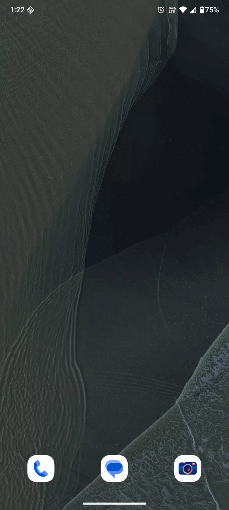
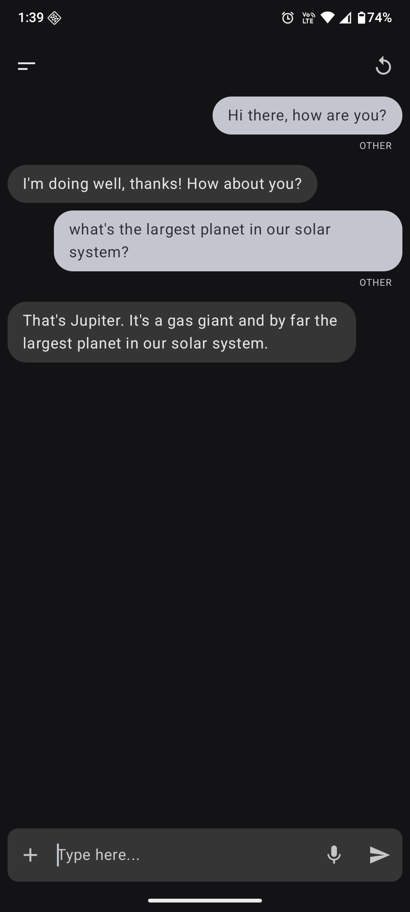
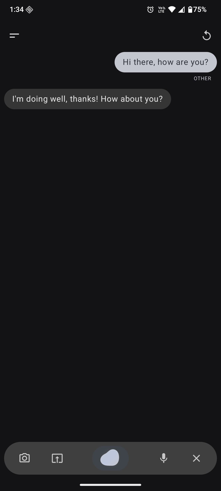
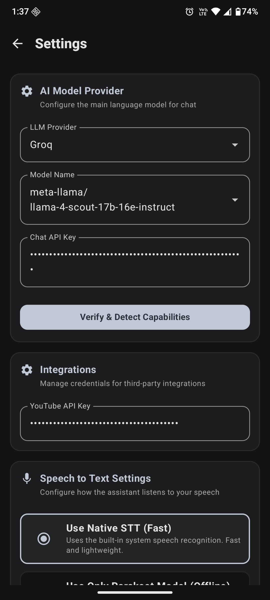

# AI Assistant for Android

[](LICENSE)
[](https://kotlinlang.org)
[](https://developer.android.com/jetpack/compose)
[](https://developers.google.com/mediapipe)
[](https://www.tensorflow.org/lite)
[](https://github.com/k2-fsa/sherpa-onnx)

An offline-first Android assistant that runs locally on your device. It supports screen vision, live camera sharing with real-time voice chat, encrypted data storage, and lets you connect your own LLM API keys. You can set it as your default phone assistant.

<div align="center">

<p>
  
</p>

<table>
  <tr align="center">
    <th width="33%">Conversational Chat UI</th>
    <th width="33%">Hands Free Floating Orb</th>
    <th width="33%">System Settings</th>
  </tr>
  <tr align="center">
    <td width="33%"></td>
    <td width="33%"></td>
    <td width="33%"></td>
  </tr>
</table>

</div>

---

## Demo

<table width="100%">
  <tr align="center">
    <td width="33%">
      <video src="https://github.com/user-attachments/assets/209f907a-494c-4c7a-b81d-275a61301a7a" width="100%" controls>
        <a href="https://github.com/user-attachments/assets/209f907a-494c-4c7a-b81d-275a61301a7a">Download/Play video</a>
      </video>
    </td>
    <td width="33%">
      <video src="https://github.com/user-attachments/assets/4b81ecef-11e2-4918-a628-b7f5bca900b0" width="100%" controls>
        <a href="https://github.com/user-attachments/assets/4b81ecef-11e2-4918-a628-b7f5bca900b0">Download/Play video</a>
      </video>
    </td>
    <td width="33%">
      <video src="https://github.com/user-attachments/assets/6ef9f91c-93fd-4b68-8dd2-980b7f750a72" width="100%" controls>
        <a href="https://github.com/user-attachments/assets/6ef9f91c-93fd-4b68-8dd2-980b7f750a72">Download/Play video</a>
      </video>
    </td>
  </tr>
</table>

---

## Table of Contents

- [Demo](#demo)
- [Overview](#overview)
- [Features](#features)
- [Architecture Overview](#architecture-overview)
- [Request Processing Flow](#request-processing-flow)
- [Technologies Used](#technologies-used)
- [Project Structure](#project-structure)
- [Setup](#setup)
- [API Configuration](#api-configuration)
- [Permissions](#permissions)
- [Supported Features Table](#supported-features-table)
- [Privacy & Security](#privacy--security)
- [Known Issues](#known-issues)
- [Roadmap](#roadmap)
- [Contributing](#contributing)
- [License](#license)

---

## Overview

This app is a private voice assistant for Android. It runs offline as much as possible, encrypts your conversations, and reads your screen when asked. You can connect it to any OpenAI-compatible LLM endpoint.

Unlike standard assistants, it does not send your voice data to external servers. It replaces Android's default assistant, so you can launch it with a long press on the home button.

---

## Features

### AI & LLM
- **Custom LLM Providers:** Works with Groq, OpenAI, Anthropic, Gemini, Ollama, LM Studio, etc.
- **Vision Auto-Detection:** Automatically tests if your model supports images and enables screen vision and live camera features if it does.
- **Fast Speech Output:** Starts speaking sentences before the model finishes generating the full response.

### Voice Pipeline
- **Voice Activation (VAD):** Detects when you start and stop talking locally on your device.
- **Interruption Support:** You can speak over the assistant to interrupt it.
- **Hands-Free Mode:** Automatically listens for your next response after speaking.
- **Audio Routing:** Supports Bluetooth headsets and speakerphone.

### Screen Vision
- **Screen Capture:** Captures screen frames locally in the background.
- **Smart Frame Syncing:** Matches the captured frame to the exact moment you started speaking.
- **Camera Sharing:** Share your live camera feed to discuss your real-world surroundings with the assistant.
- **Privacy Controls:** Easily pause or stop screen capture from a system notification.

### Privacy & Encryption
- **Secure Storage:** Encrypts conversations and attachments using AES-256-GCM.
- **Safe Deletion:** Securely deletes files from the device when you delete a message or chat.

### Offline Tools
- **Offline Actions:** Processes commands (like calling or navigation) offline using an on-device model.
- **Offline Speech & Voice:** Handles speech-to-text and text-to-speech without internet.
- **Offline Translation:** Translates input to English locally using Google ML Kit.

### Android Integration
- **Default Assistant:** Launch by long-pressing the home button or swiping.
- **Lock Screen Support:** Answer voice queries without unlocking your phone.
- **System Actions:** Set alarms, dial contacts (with fuzzy name matching), search YouTube music, and check the weather.

---


## Architecture Overview

The app is built around offline first, modular components. Each layer can be swapped independently.


**Design details:**
- **Flexible LLM Adapter:** Uses templates to support any OpenAI-compatible API endpoint.
- **Intent Verification:** Checks user queries against keyword lists to prevent incorrect system actions.
- **Local Encryption:** All conversation history and files are encrypted before saving to disk.

---

## Request Processing Flow

<details>
<summary><strong>Voice / Text Input</strong></summary>

When you speak or type, the app processes the audio locally:
1. It records and cleans up the audio.
2. It detects when you start and stop speaking.
3. If you speak while the assistant is answering, it stops talking and listens to you.

</details>

<details>
<summary><strong>Audio Processing & STT</strong></summary>

The app converts your speech to text using either Android's built-in system, an offline voice model, or a cloud API.

</details>

<details>
<summary><strong>Translation & Classification</strong></summary>

1. If you speak a non-English language, the app translates it to English offline using Google ML Kit.
2. It classifies the text to determine your intent (e.g., call, alarm, navigation, or general question).
3. It double-checks keywords to make sure it doesn't run a system command by mistake.

</details>

<details>
<summary><strong>Native Actions & Lock States</strong></summary>

When the app identifies a command, it runs the matching phone action:
- **Calls:** Searches contacts and dials the number.
- **Music:** Searches and plays songs on YouTube.
- **Alarms/Reminders:** Sets system alarms using natural time phrasing.
- **Navigation:** Launches Google Maps navigation.
- **Weather:** Gets your location and displays the forecast.

If a command is missing information (like a name for a call), the app will ask you for it directly on the next turn.

</details>

<details>
<summary><strong>LLM & Vision</strong></summary>

General questions go to your selected LLM. If you use screen vision or live camera sharing, the app attaches the latest captured frame from your screen or camera when you start speaking, provided your selected LLM supports images.

</details>

<details>
<summary><strong>Streaming TTS</strong></summary>

As the LLM generates a response, the app parses it sentence-by-sentence. Once a sentence is ready, the voice engine starts speaking it immediately so you don't have to wait for the full response to load.

</details>

<details>
<summary><strong>Conversation Storage</strong></summary>

All messages are encrypted and saved locally. Attached files are also encrypted before saving. Deleting a message or chat deletes all associated files permanently.

</details>

---

## Technologies Used

| Category | Technology |
|---|---|
| Language | Kotlin |
| UI | Jetpack Compose, Material You |
| Architecture | MVVM, ViewModel, Coroutines, Flow |
| On-Device ML | MediaPipe Text Classifier, TensorFlow Lite, Sherpa-ONNX (Silero VAD, Parakeet STT, VITS TTS) |
| Translation | Google ML Kit On-Device Translation |
| Database | Room (encrypted via Android KeyStore + AES-256-GCM) |
| Networking | OkHttp, Retrofit |
| TTS | Edge TTS (WebSocket), Google Cloud TTS, Sherpa-ONNX VITS, Android TextToSpeech |
| APIs | Groq (default LLM), YouTube Data API v3, Open-Meteo (weather) |
| Location | GMS Fused Location Provider |

---

## Project Structure

```
app/src/main/java/com/app/assistant/
│
├── AssistActivity.kt            # Entry point for system assistant integration
├── MainActivity.kt              # Main UI activity and lifecycle management
│
├── api/                         # HTTP clients and API services
│
├── camera/
│   ├── ScreenCaptureService.kt  # Captures screenshots periodically
│   └── VisualBufferManager.kt   # Stores captured frames with timestamps
│
├── classifier/
│   └── TextClassifierHelper.kt  # Local TFLite intent classifier
│
├── db/
│   ├── AppDatabase.kt           # Room database setup
│   ├── EncryptionUtil.kt        # Encryption helpers (AES-GCM + KeyStore)
│   ├── DynamicConversationRepo  # Handles encrypted database operations
│   └── *Entity.kt               # Database schemas
│
├── llm/
│   ├── FlexibleLlmAdapter.kt    # API adapter for various LLMs
│   ├── ModelCapabilityProber.kt # Detects model vision capability
│   └── LlmMessage.kt            # LLM data schemas
│
├── repository/
│   ├── ContactsRepository.kt    # Matches contact names offline
│   ├── SettingsRepository.kt    # App settings manager
│   └── WeatherRepository.kt     # Location and weather logic
│
├── speech/
│   ├── AudioHygieneProcessor.kt    # Audio recording and processing
│   ├── VadIntelligenceProcessor.kt # On-device speech detection (VAD)
│   ├── VoiceStateMachine.kt        # Manages voice states (listening, speaking)
│   └── SpeechRecognizerManager.kt  # Manages speech-to-text engines
│
├── translation/
│   └── TranslatorManager.kt     # Manages offline translation
│
├── tts/
│   ├── TtsEngineSelector.kt     # Switches between TTS engines
│   ├── EdgeTtsApiManager.kt     # Microsoft Edge TTS integration
│   ├── GoogleTtsApiManager.kt   # Google Cloud TTS integration
│   ├── OfflineTtsManager.kt     # On-device TTS integration
│   └── NativeTtsManager.kt      # Default system TTS fallback
│
└── ui/
    ├── screen/
    │   ├── ChatScreen.kt         # Main chat screen logic
    │   ├── ChatLayout.kt         # Layout definitions for chat
    │   ├── ConversationItem.kt   # Chat item UI elements
    │   ├── HandsFreeBar.kt       # Voice UI overlay
    │   ├── SettingsScreen.kt     # Settings layout and configuration
    │   └── UserInputField.kt     # Text input and file picker UI
    └── theme/                    # Theme, styling, and typography
```

---

## Setup

**Prerequisites**
- Android Studio
- Device or emulator (Android 8.0+ / API 26+)
- Groq API key (or another OpenAI-compatible endpoint key)
- YouTube Data API v3 key

**Steps**
1. Clone this repository:
   ```bash
   git clone https://github.com/your-username/ai-assistant-android.git
   cd ai-assistant-android
   ```
2. Open the project in Android Studio and let files sync.
3. Configure your API keys (see details in the API Configuration section).
4. Run the app on your device.
5. (Optional) Set the app as your default assistant under **Settings → Apps → Default Apps → Digital assistant app**.

---

## API Configuration

Choose one of these methods to configure your API keys:

**Option 1: Using `local.properties`**
Add the keys to your `local.properties` file:
```properties
YOUTUBE_API_KEY=YOUR_YOUTUBE_API_KEY
GROQ_API_KEY=YOUR_GROQ_API_KEY
EDGE_TTS_SUBSCRIPTION_KEY=YOUR_EDGE_TTS_SUBSCRIPTION_KEY
```
Gradle will load these during the build. (Make sure this file is not committed to git).

**Option 2: In-App Settings**
Open the app, go to **Settings**, and paste your keys directly into the input fields. This does not require rebuilding the app.

**Customizing the LLM Endpoint**
In the settings page, you can change the default URL to any OpenAI-compatible server (like Ollama, LM Studio, Anthropic, or Gemini). The app automatically checks if the custom endpoint supports images.

---

## Permissions

| Permission | Required For |
|---|---|
| `RECORD_AUDIO` | Listening to voice input |
| `CAMERA` | Accessing the camera for live camera sharing |
| `READ_CONTACTS` | Searching contact names to make calls |
| `CALL_PHONE` | Making phone calls |
| `ACCESS_FINE_LOCATION` | Checking weather and generating navigation routes |
| `MEDIA_PROJECTION` | Recording the screen for screen vision |
| `BLUETOOTH` / `BLUETOOTH_CONNECT` | Supporting Bluetooth headsets |
| `POST_NOTIFICATIONS` | Showing the screen capture status bar notification |

---

## Supported Features Table

| Feature | Offline | Cloud | Native Android | AI / LLM |
|---|:---:|:---:|:---:|:---:|
| Voice activity detection (VAD) | ✅ | | | |
| Speech-to-text (Parakeet) | ✅ | | | |
| Speech-to-text (Cloud) | | ✅ | | |
| Intent classification | ✅ | | | |
| Language translation | ✅ | | | |
| Offline TTS (VITS) | ✅ | | | |
| Neural TTS (Edge) | | ✅ | | |
| Encrypted storage | ✅ | | | |
| Phone calls | | | ✅ | |
| Alarms & reminders | | | ✅ | |
| Google Maps navigation | | | ✅ | |
| YouTube music playback | | ✅ | | |
| Weather forecasts | | ✅ | | |
| Contact matching | ✅ | | ✅ | |
| Screen vision | | | ✅ | ✅ |
| Live camera sharing | | | ✅ | ✅ |
| General chat | | | | ✅ |
| Custom LLM endpoints | | ✅ | | ✅ |
| Image & file attachments | | | | ✅ |

---

## Privacy & Security

Your data stays on your device unless it is sent to your selected LLM provider.

**Database Encryption**
The app generates an AES-256 encryption key inside Android's secure hardware Keystore. All messages and chat titles are encrypted before saving. Each record uses a unique initialization vector.

**File Encryption**
All saved images, documents, and screenshots are encrypted before they are written to disk.

**Secure Deletion**
When you delete a message or chat, the app deletes the database records and removes the associated files from disk.

**Voice Processing**
Your raw voice audio is never stored or sent anywhere. Voice detection is handled entirely in memory on the device, and only the transcribed text is processed.

---

## Known Issues

- **Barge-In Interruption:** Sometimes the barge-in/interruption feature does not trigger correctly when speaking over the assistant. Work is underway to refine this.
- **Translation Disabled:** The translation feature is currently disabled due to conflicts with streaming text output. A new approach is being developed.
- **Settings Classification:** Settings-related commands (unlike Call, Play Song, etc., which work) do not have a separate action yet. Instead, they are classified under `OTHER` and sent directly to the LLM. A new approach is being worked on to support settings actions natively.

---

## Roadmap

- [ ] Android XR support for smart glasses
- [ ] Wear OS support for wrist control
- [ ] Category for sending text messages through actions
- [ ] Automatic summary of older conversations
- [ ] Screen capture using Accessibility Services to avoid permission prompts

---

## Contributing

Contributions are welcome. Please open an issue to discuss new features before making changes, or open a pull request directly for bug fixes.

1. Fork the repository and create a branch.
2. Follow the project's coding style (standard Kotlin, MVVM architecture).
3. Submit a pull request explaining your changes.

Make sure your changes do not store unencrypted user data or bypass security features.

---

## License

This project is licensed under the [MIT License](LICENSE).

Copyright © 2026 Sourav Anand.
