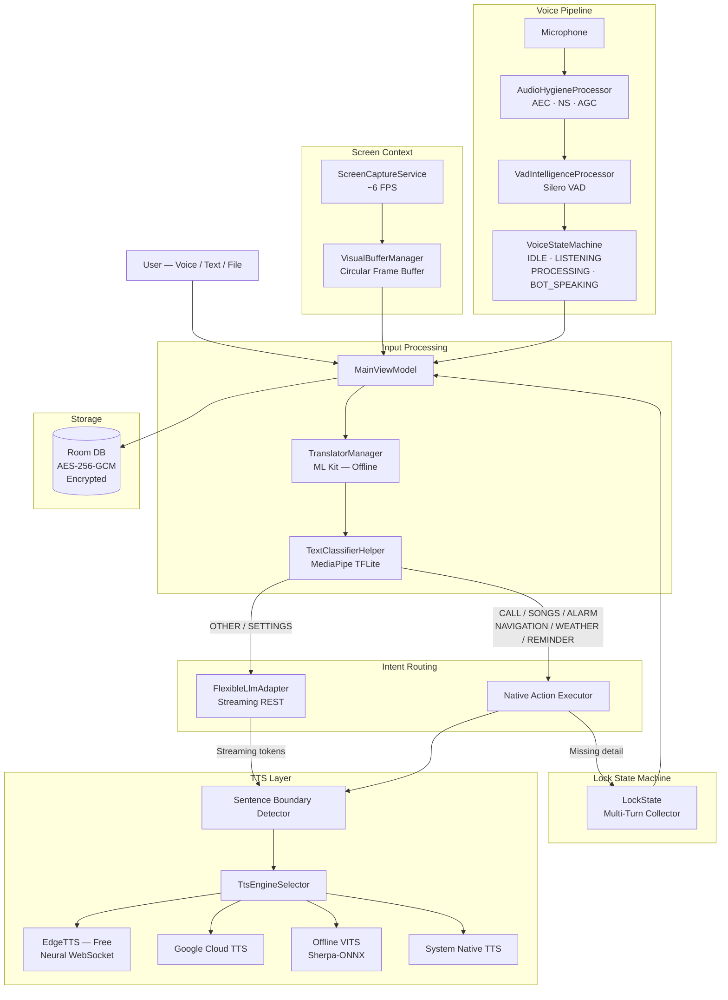

<div align="center">

# AI Assistant for Android

[](LICENSE)
[](https://kotlinlang.org)
[](https://developer.android.com/jetpack/compose)
[](https://developers.google.com/mediapipe)
[](https://www.tensorflow.org/lite)
[](https://github.com/k2-fsa/sherpa-onnx)

**A private, offline-first alternative to Gemini Live with real-time screen vision, encrypted storage, and Bring-Your-Own-Key (BYOK) LLM support, engineered to replace the system default assistant.**

<p>
  
</p>

</div>

---

## 📋 Table of Contents

- [Overview](#-overview)
- [Why This Project?](#-why-this-project)
- [Features](#-features)
- [Screenshots](#-screenshots)
- [Architecture Overview](#%EF%B8%8F-architecture-overview)
- [Request Processing Flow](#-request-processing-flow)
- [Technologies Used](#-technologies-used)
- [Project Structure](#-project-structure)
- [Setup](#-setup)
- [API Configuration](#-api-configuration)
- [Permissions](#-permissions)
- [Supported Features Table](#-supported-features-table)
- [Privacy & Security](#-privacy--security)
- [Roadmap](#-roadmap)
- [Contributing](#-contributing)
- [License](#-license)

---

## 🔍 Overview

AI Assistant is a production-quality Android voice assistant designed around three principles: **privacy**, **offline capability**, and **extensibility**. It integrates a custom three-layer audio pipeline, on-device intent classification, encrypted conversation storage, real-time screen vision, and a flexible LLM adapter that works with any OpenAI-compatible API endpoint.

Unlike consumer assistants, no voice data is sent to a vendor. The app hooks directly into Android's system assistant slot, giving it the same home-button activation as Google Assistant — but with full control over what happens with your data.

---

## 💡 Why This Project?

Most Android assistant apps are thin wrappers around a cloud API. This project takes a fundamentally different approach:

| Typical Assistant App | This Project |
|---|---|
| Cloud-only speech recognition | On-device VAD + selectable STT engines |
| No conversation encryption | AES-256-GCM via Android KeyStore |
| Single fixed LLM provider | Plug any OpenAI/Gemini/Anthropic-compatible endpoint |
| No screen awareness | Real-time screen capture with temporal frame syncing |
| Hands-free requires wake word cloud service | On-device Silero VAD with barge-in interruption 

The result is an assistant that can run mostly offline, understands what's on your screen, and stores nothing in plaintext.

---

## ✨ Features

### 🤖 AI & LLM
- Connect to **any REST LLM endpoint** — Groq, OpenAI, Anthropic, Gemini, Ollama, LM Studio
- Automatic **capability probing**: sends a test image to detect vision support and dynamically enables multimodal features
- **Streaming token playback**: first sentence starts speaking before the LLM finishes generating

### 🎙️ Voice Pipeline
- **Three-layer audio architecture**: hardware echo cancellation → on-device VAD → state machine orchestrator
- **Silero VAD** (via Sherpa-ONNX) for precise speech boundary detection, no cloud round-trips
- **Barge-in / interruption**: speak while the assistant is talking to interrupt it with a 300 ms echo-bleed guard
- **Hands-free auto-loop**: automatically re-enters listening state after each assistant response
- Bluetooth SCO and Speakerphone routing for headsets and hands-free modes

### 👁️ Screen Vision
- Background **screen capture service** at ~6 FPS into a bounded circular frame buffer
- **Temporal frame syncing**: retrieves the frame closest to the moment speech started — so the LLM sees exactly what you were looking at
- Frames scaled to 720 px and JPEG-compressed before being sent to the LLM
- Controllable via a persistent Material You notification with Stop and Mute actions

### 🔐 Privacy & Security
- All conversation text encrypted with **AES-256-GCM** via a hardware-backed Android KeyStore key
- Unique IV generated per database entry; no two records share the same nonce
- Attached images, documents, and captured frames encrypted before writing to disk
- **Wipe-clean deletion**: files decrypted, dereferenced, and removed from disk on message/chat deletion

### 🌐 Offline Intelligence
- On-device **intent classification** using a custom 26 MB TFLite model via MediaPipe
- On-device **speech-to-text** option via Parakeet (Sherpa-ONNX)
- On-device **TTS** using a VITS Supertonic model (Sherpa-ONNX), no API key required
- Bidirectional **offline translation** for non-English users via Google ML Kit language packs

### 📱 Android Integration
- Replaces the **system default assistant** (home button long-press, diagonal swipe)
- **Lock screen bypass**: responds to voice queries without unlocking the device
- Fuzzy **contact matching** (exact → token → prefix similarity) before dialing
- Native **alarm & reminder scheduling** with natural language time parsing
- **Google Maps navigation** and **weather forecasts** via GPS Fused Location Provider
- **YouTube music search** and playback

---

## 📸 Screenshots

| Conversational Chat UI | Hands-Free Floating Orb | System Settings |
|:---:|:---:|:---:|
|  |  |  |

---

## 🏗️ Architecture Overview

The app is built around offline-first, modular components. Each layer can be swapped independently.



**Key design decisions:**

- **No hardcoded LLM**: `FlexibleLlmAdapter` uses template substitution (`{{MODEL}}`, `{{MESSAGES}}`, `{{SYSTEM_CONTEXT}}`), making any REST endpoint a drop-in.
- **Lexical safeguards**: ML classifiers can misfire. A vocabulary cross-check gates every intent before executing native actions.
- **Encryption at rest, not in transit**: the app trusts the OS network stack for TLS but never stores anything in plaintext on disk.

---

## 🔄 Request Processing Flow

<details>
<summary><strong>Voice / Text Input</strong></summary>

The user speaks or types in the `ChatScreen`. Voice input flows through the three-layer audio pipeline:

1. `AudioHygieneProcessor` records at 16 kHz Mono 16-bit PCM and applies hardware AEC, Noise Suppression, and AGC.
2. `VadIntelligenceProcessor` feeds PCM samples into Silero VAD in 512-sample windows to detect speech start and end boundaries.
3. `VoiceStateMachine` tracks the conversation turn state and handles barge-in: if the user speaks while the assistant is responding, TTS is halted after a 300 ms echo-bleed window and listening resumes.

</details>

<details>
<summary><strong>Audio Processing & STT</strong></summary>

`SpeechRecognizerManager` routes recognized audio to the configured STT engine — Android's native recognizer, on-device Parakeet (Sherpa-ONNX), a hybrid mode, or a cloud API. The recognized text is passed to the `MainViewModel`.

</details>

<details>
<summary><strong>Translation & Classification</strong></summary>

If the user's language is set to non-English, `TranslatorManager` translates the input to English using an offline ML Kit language pack.

The English text is then passed to `TextClassifierHelper`, which runs the 26 MB custom TFLite model via MediaPipe to produce an intent label: `CALL`, `SONGS`, `ALARM`, `REMINDER`, `NAVIGATION`, `WEATHER`, `SETTINGS`, or `OTHER`.

`ProcessChatCommandUseCase` cross-checks the label against category-specific vocabulary maps. If no matching keywords are found, the intent is demoted to `OTHER`.

</details>

<details>
<summary><strong>Native Actions & Lock States</strong></summary>

Confirmed intents trigger native Android actions:

- **Call** — fuzzy contact search (exact → token → prefix similarity > 0.7), then `CALL_PHONE` intent.
- **Songs** — YouTube Data API v3 search, then playback.
- **Alarm / Reminder** — natural language time parsing via regex, then system alarm scheduling.
- **Navigation** — location extraction and `google.navigation:q=…` intent.
- **Weather** — GMS Fused Location Provider → forecast fetch → weather card UI.

If an intent is confirmed but a required detail is missing (e.g., no contact name), a `LockState` is set. The next user turn bypasses classification and is routed directly to fill the missing variable, then the action fires.

</details>

<details>
<summary><strong>LLM & Vision</strong></summary>

`OTHER` queries — or any query with an attached file — are sent to the configured LLM via `FlexibleLlmAdapter`. If screen vision is active, the frame closest to the moment speech began is retrieved from `VisualBufferManager` and attached to the request. Full conversation history is included as context.

`ModelCapabilityProber` previously verified whether the endpoint accepts image inputs; vision attachment is skipped if the model does not support it.

</details>

<details>
<summary><strong>Streaming TTS</strong></summary>

As the LLM streams response tokens, `MainViewModel` appends them to a text buffer and calls `findSentenceBoundary()` after each token. The parser uses `isAbbreviationOrDecimal()` to skip false boundaries like `Mr.`, `3.14`, or `e.g.`. The moment a complete sentence is detected, it is dequeued and sent to the active `TtsManager` — Edge TTS, Google TTS, Offline VITS, or Native — so speech begins before the LLM finishes generating.

After TTS completes in hands-free mode, `VoiceStateMachine` automatically returns to `LISTENING`.

</details>

<details>
<summary><strong>Conversation Storage</strong></summary>

Every message — user and assistant — is encrypted with AES-256-GCM before writing to the Room database. A unique IV is generated per entry. Attached files are encrypted before writing to private app storage. On deletion, the repository decrypts file paths, removes the files from disk, and removes the database records.

</details>

---

## 🛠️ Technologies Used

| Category | Technology |
|---|---|
| Language | Kotlin |
| UI | Jetpack Compose, Material You |
| Architecture | MVVM, ViewModel, Coroutines, Flow |
| On-Device ML | MediaPipe Text Classifier, TensorFlow Lite, Sherpa-ONNX (Silero VAD, Parakeet STT, VITS TTS) |
| Translation | Google ML Kit On-Device Translation |
| Database | Room (encrypted via Android KeyStore + AES-256-GCM) |
| Networking | OkHttp, Retrofit |
| TTS | Edge TTS (WebSocket), Google Cloud TTS, Sherpa-ONNX VITS, Android TextToSpeech |
| APIs | Groq (default LLM), YouTube Data API v3, Open-Meteo (weather) |
| Location | GMS Fused Location Provider |

---

## 📁 Project Structure

```
app/src/main/java/com/app/assistant/
│
├── AssistActivity.kt            # System assistant entry point (ACTION_ASSIST hook)
├── MainActivity.kt              # UI host, permission manager, lifecycle observer
│
├── api/                         # Retrofit interfaces and HTTP clients
│
├── camera/
│   ├── ScreenCaptureService.kt  # Foreground MediaProjection capture loop (~6 FPS)
│   └── VisualBufferManager.kt   # Bounded circular frame buffer with timestamp lookup
│
├── classifier/
│   └── TextClassifierHelper.kt  # MediaPipe TFLite intent classifier (model.tflite, 26 MB)
│
├── db/
│   ├── AppDatabase.kt           # Room database definition
│   ├── EncryptionUtil.kt        # AES-256-GCM + Android KeyStore key management
│   ├── DynamicConversationRepo  # CRUD with transparent encrypt/decrypt layer
│   └── *Entity.kt               # Schemas: Messages, Groups, Attachments
│
├── llm/
│   ├── FlexibleLlmAdapter.kt    # Template-based HTTP LLM client (any REST endpoint)
│   ├── ModelCapabilityProber.kt # Vision & model-list capability prober
│   └── LlmMessage.kt            # LLM request/response schemas
│
├── repository/
│   ├── ContactsRepository.kt    # Offline fuzzy contact name matching
│   ├── SettingsRepository.kt    # SharedPreferences configuration wrapper
│   └── WeatherRepository.kt     # GPS geocoding and forecast fetcher
│
├── speech/
│   ├── AudioHygieneProcessor.kt    # 16 kHz PCM recorder with AEC, NS, AGC
│   ├── VadIntelligenceProcessor.kt # Silero VAD frame evaluator (512-sample windows)
│   ├── VoiceStateMachine.kt        # Turn lifecycle + barge-in logic
│   └── SpeechRecognizerManager.kt  # STT engine orchestrator
│
├── translation/
│   └── TranslatorManager.kt     # ML Kit offline translation pack controller
│
├── tts/
│   ├── TtsEngineSelector.kt     # Selects and switches between TTS engines
│   ├── EdgeTtsApiManager.kt     # Microsoft Edge WebSocket neural TTS (free, no key)
│   ├── GoogleTtsApiManager.kt   # Google Cloud TTS via MediaCodec + AudioTrack
│   ├── OfflineTtsManager.kt     # Sherpa-ONNX VITS model (fully offline)
│   └── NativeTtsManager.kt      # Android system TextToSpeech fallback
│
└── ui/
    ├── screen/
    │   ├── ChatScreen.kt         # Main chat controller
    │   ├── ChatLayout.kt         # Compose chat thread layouts
    │   ├── ConversationItem.kt   # Adaptive cards (call, music, maps, thinking, attachments)
    │   ├── HandsFreeBar.kt       # Animated floating orb with pulse glow rings
    │   ├── SettingsScreen.kt     # Config UI with capability badges and download progress
    │   └── UserInputField.kt     # Input box with file attachment preview
    └── theme/                    # Colors, typography, dark/light themes
```

---

## ⚙️ Setup

**Prerequisites**

- Android Studio
- Android device or emulator running API 26+
- YouTube Data API v3 key
- Groq API key (or any OpenAI-compatible endpoint)

**Steps**

1. Clone the repository:
   ```bash
   git clone https://github.com/your-username/ai-assistant-android.git
   cd ai-assistant-android
   ```

2. Open the project in Android Studio and allow Gradle to sync.

3. Add your API keys (see [API Configuration](#-api-configuration) below).

4. Connect a device or start an emulator, then click **Run**.

5. To use the app as your system assistant: go to **Settings → Apps → Default Apps → Digital assistant app** and select this app.

---

## 🔑 API Configuration

Two methods are available — use whichever fits your workflow.

**Option A — `local.properties` (recommended for development)**

Create or edit `local.properties` in the project root:

```properties
YOUTUBE_API_KEY=YOUR_YOUTUBE_API_KEY
GROQ_API_KEY=YOUR_GROQ_API_KEY
```

Gradle reads these at build time and exposes them as `BuildConfig` fields. This file should already be in `.gitignore` — verify before committing.

**Option B — In-app Settings**

Install the app, open the **Navigation Drawer**, navigate to **Settings**, and paste your keys into the respective fields. No rebuild required.

**Custom LLM Endpoint**

In Settings, you can replace the default Groq endpoint with any OpenAI-compatible API URL (Ollama, LM Studio, Anthropic, Gemini, etc.). The app will probe the endpoint for vision support and available model lists automatically.

---

## 🔒 Permissions

The app requests permissions at runtime, only when a feature that needs them is first used.

| Permission | Required For |
|---|---|
| `RECORD_AUDIO` | Voice input and VAD processing |
| `READ_CONTACTS` | Fuzzy contact search for phone calls |
| `CALL_PHONE` | Initiating calls |
| `ACCESS_FINE_LOCATION` | Weather forecasts, navigation |
| `MEDIA_PROJECTION` | Screen vision capture |
| `BLUETOOTH` / `BLUETOOTH_CONNECT` | Bluetooth SCO headset routing |
| `POST_NOTIFICATIONS` | Screen capture service notification |

---

## 📊 Supported Features Table

| Feature | Offline | Cloud | Native Android | AI / LLM |
|---|:---:|:---:|:---:|:---:|
| Voice recognition (VAD) | ✅ | | | |
| Speech-to-text (Parakeet) | ✅ | | | |
| Speech-to-text (Cloud) | | ✅ | | |
| Intent classification | ✅ | | | |
| Language translation | ✅ | | | |
| Offline TTS (VITS) | ✅ | | | |
| Edge TTS (neural) | | ✅ | | |
| Conversation storage (encrypted) | ✅ | | | |
| Phone calls | | | ✅ | |
| Alarm & reminder scheduling | | | ✅ | |
| Google Maps navigation | | | ✅ | |
| Music playback (YouTube) | | ✅ | | |
| Weather forecasts | | ✅ | | |
| Contact fuzzy matching | ✅ | | ✅ | |
| Screen vision | | | ✅ | ✅ |
| General Q&A | | | | ✅ |
| Custom LLM endpoint | | ✅ | | ✅ |
| File & image attachments | | | | ✅ |

---

## 🛡️ Privacy & Security

All personally identifiable data stays on device or is explicitly sent by the user's chosen LLM endpoint.

**Database encryption**
On first launch, the app generates a 256-bit AES key inside the hardware-backed Android KeyStore (TEE or Secure Element) under the alias `com.app.assistant.database_key`. Every message body and chat title is encrypted with AES-256-GCM before being written to the Room database. Each record gets a unique initialization vector — no two ciphertexts share a nonce.

**File encryption**
Attached documents, images, and screen frames are encrypted with the same AES-GCM scheme before being written to the app's private storage directory. The unencrypted bytes are never persisted to disk.

**Deletion**
Deleting a message or chat group triggers a cascading cleanup: the repository decrypts the stored file paths, deletes the corresponding files from disk, and removes all database records. No orphaned ciphertext is left behind.

**Voice data**
Raw PCM audio is never stored or transmitted. VAD evaluation happens entirely in memory on-device. Only the recognized text is passed downstream.

---

## 🗺️ Roadmap

- [ ] Wake-word activation ("Hey Assistant") using on-device detection
- [ ] Multi-user encrypted profile support
- [ ] Wear OS companion for hands-free wrist control
- [ ] Plugin system for custom intent handlers
- [ ] Per-conversation LLM model switching
- [ ] Background conversation summarization
- [ ] Accessibility service mode (no screen capture permission needed)

---

## 🤝 Contributing

Contributions are welcome. If you're fixing a bug, open a PR directly. For new features or significant changes, open an issue first to discuss the approach.

1. Fork the repository and create a feature branch.
2. Follow the existing code style (Kotlin idioms, single-responsibility ViewModels).
3. Open a pull request with a clear description of the change and why it was made.

Please ensure your changes do not introduce any plaintext storage of user data or bypass the encryption layer.

---

## 📜 License

This project is licensed under the [MIT License](LICENSE).

Copyright © 2026 Sourav Anand.
